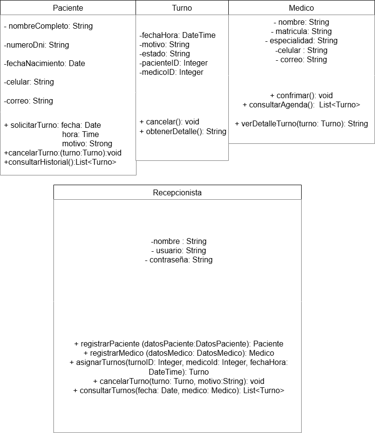

 [Introduccion](#introduccion)
 
 [Fundamentos](#Fundamentos)
 
 [Requisitos iniciales](#Requisitos)
 
 [Casos de uso](#casos)
 
 [Boceto inicial](#Boceto)

# Introducción(#Introduccion)

¿Qué es la Programación Orientada a Objetos (POO)?
La Programación Orientada a Objetos (POO) es un paradigma de programación basado en la organización del código en objetos, que representan entidades del mundo real.
Es importante porque permite crear software modular, reutilizable y fácil de mantener.

# Fundamentos de POO (#Fundamentos)

- Abstracción:
  
Es la capacidad de representar elementos del mundo real en el código.
Ejemplo: Un "Auto" puede representarse con atributos (marca, modelo) y métodos (arrancar, frenar).

- Encapsulamiento:
  
Protege los datos de un objeto, permitiendo acceso solo a través de métodos específicos.
Ejemplo: Un "Cajero Automático" no permite acceso directo al dinero, solo mediante transacciones.

- Herencia:
  
Permite que una clase reutilice características de otra.
Ejemplo: Un "Auto Deportivo" hereda de la clase "Auto", pero añade características como mayor velocidad.

- Polimorfismo:

Permite que una misma acción tenga diferentes comportamientos según el objeto.
Ejemplo: Un "Animal" puede hacer un sonido, pero cada tipo de animal emite un sonido diferente (perro: ladrido, gato: maullido).

# Requisitos iniciales del sistema (#Requisitos)
- Registro de usuarios: El sistema debe permitir la creación y gestión de usuarios.

- Gestión de turnos: Los usuarios deben poder solicitar, cancelar y reprogramar turnos.

- Notificaciones: El sistema debe enviar recordatorios de turnos vía correo o mensaje.

- Historial de turnos: Se debe permitir consultar turnos pasados.

- Control de acceso:Solo usuarios registrados pueden acceder a ciertas funciones.
# Casos de uso
 ## Caso 1
 - Notificaciones de Turno
   
Descripción:

- El sistema envía notificaciones a los usuarios sobre sus turnos programados.

 Precondiciones:
 
  - El usuario debe estar registrado en el sistema.
  - El usuario debe haber proporcionado un medio de contacto (correo electrónico, número de teléfono, etc.).
  - El turno debe estar programado y confirmado.

 Postcondiciones

   - El usuario recibe una notificación sobre su turno.
   - Se registra la fecha y hora de la notificación en el sistema.

## Caso 2
 - Cambio de Turno
 
Descripción:
 - Un usuario puede solicitar un cambio en su turno programado.

 Precondiciones:
 
  - El usuario debe estar registrado y autenticado en el sistema.
  - El turno original debe estar confirmado y no debe estar dentro del período de cancelación.
  - El nuevo turno solicitado debe estar disponible.

 Postcondiciones:
 
  - El turno original se actualiza con la nueva información.
  - Se envía una notificación al usuario confirmando el cambio de turno.
  - Se registra el cambio en el historial de turnos del usuario.

## Caso 3

- Cancelación de Turno
  
Descripción:

  - Un usuario puede cancelar un turno programado.

 Precondiciones:
 
  - El usuario debe estar registrado y autenticado en el sistema.
  - El turno debe estar confirmado y dentro del período de cancelación permitido.

 Postcondiciones:
 
  - El turno se marca como cancelado en el sistema.
  - Se envía una notificación al usuario confirmando la cancelación.
  - Se actualiza la disponibilidad del turno en el sistema.

 ## Caso 4
  - Pedir turno
  
 Descripción: 
 
   - Permite a un usuario pedir un turno dentro de las especialidades.

 Precondiciones:
   - El usuario debe estar autenticado y tener un método de pago válido.
     
 Postcondiciones:
 
   - La compra se ha completado y el usuario recibe la confirmación.

## Caso 5
 - Consulta de Turnos
   
Descripción:

  - Un usuario puede consultar sus turnos programados.

 Precondiciones:
 
  - El usuario debe estar registrado y autenticado en el sistema.

 Postcondiciones:
 
  - El sistema muestra una lista de los turnos programados del usuario.
  - Se registra la consulta en el historial de actividades del usuario.

  
# Boceto inicial del diseño de clases (#Boceto)

[Acceder al archivo](https://drive.google.com/file/d/1o6qPzOSaIVrl_R35Emcjz081xn35yq5y/view?usp=sharing)

